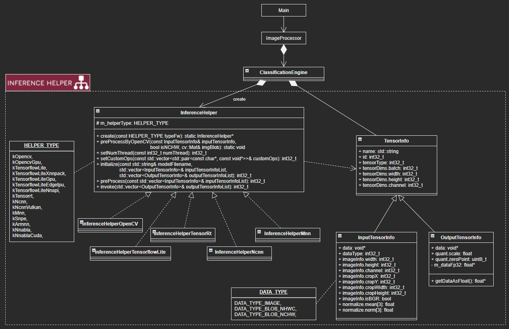

# InferenceHelper_Sample
- Sample project for Inference Helper (https://github.com/iwatake2222/InferenceHelper )
- Run a simple classification model (MobileNetv2) using several deep leraning frameworks

[](https://github.com/iwatake2222/InferenceHelper_Sample/actions/workflows/ci_windows.yml)
[](https://github.com/iwatake2222/InferenceHelper_Sample/actions/workflows/ci_ubuntu.yml)
[](https://github.com/iwatake2222/InferenceHelper_Sample/actions/workflows/ci_arm.yml)

 

## Usage
```
./main [input]

 - input = blank
    - use the default image file set in source code (main.cpp)
    - e.g. ./main
 - input = *.mp4, *.avi, *.webm
    - use video file
    - e.g. ./main test.mp4
 - input = *.jpg, *.png, *.bmp
    - use image file
    - e.g. ./main test.jpg
 - input = number (e.g. 0, 1, 2, ...)
    - use camera
    - e.g. ./main 0
```

## How to build a sample project
### 0. Requirements
- OpenCV 4.x

### 1. Download 
- Get source code
    ```sh
    git clone https://github.com/iwatake2222/InferenceHelper_Sample
    cd InferenceHelper_Sample
    git submodule update --init
    sh InferenceHelper/third_party/download_prebuilt_libraries.sh
    ```
    - If you have a problem, please refer to  https://github.com/iwatake2222/InferenceHelper#installation
    - If your host PC is Windows but you want to build/run on Linux, it's better to run this script on the target device(Linux). Otherwise, symbolic link will broken.
- Download models
    ```sh
    sh ./download_resource.sh
    ```

### 2-a. Build in Linux (PC Ubuntu, Raspberry Pi, Jetson Nano, etc.)
```sh
cd pj_cls_mobilenet_v2
mkdir -p build && cd build
cmake .. -DINFERENCE_HELPER_ENABLE_MNN=on
make
./main
```

### 2-b. Build in Windows (Visual Studio)
- Configure and Generate a new project using cmake-gui for Visual Studio 2019 64-bit
    - `Where is the source code` : path-to-InferenceHelper_Sample/pj_cls_mobilenet_v2
    - `Where to build the binaries` : path-to-build	(any)
    - Check one of the liseted InferenceHelperFramework (e.g. `INFERENCE_HELPER_ENABLE_MNN` )
- Open `main.sln`
- Set `main` project as a startup project, then build and run!

### 2-c. Build in Linux (Cross compile for armv7 and aarch64)
```
sudo apt install g++-arm-linux-gnueabi g++-arm-linux-gnueabihf g++-aarch64-linux-gnu

export CC=aarch64-linux-gnu-gcc
export CXX=aarch64-linux-gnu-g++
cmake .. -DBUILD_SYSTEM=aarch64 -DINFERENCE_HELPER_ENABLE_MNN=on

export CC=arm-linux-gnueabi-gcc
export CXX=arm-linux-gnueabi-g++
cmake .. -DBUILD_SYSTEM=armv7 -DINFERENCE_HELPER_ENABLE_MNN=on
```

You need to link appropreate OpenCV.

### 2-d. Build in Android Studio
- Requirements
    - Android Studio
        - Compile Sdk Version
            - 30
        - Build Tools version
            - 30.0.0
        - Target SDK Version
            - 30
        - Min SDK Version
            - 24
            - With 23, I got the following error
                - `bionic/libc/include/bits/fortify/unistd.h:174: undefined reference to `__write_chk'`
                - https://github.com/android/ndk/issues/1179
    - Android NDK
        - 23.1.7779620
    - OpenCV
        - opencv-4.3.0-android-sdk.zip
    - *The version is just the version I used

- Configure NDK
    - File -> Project Structure -> SDK Location -> Android NDK location (before Android Studio 4.0)
        - C:\Users\abc\AppData\Local\Android\Sdk\ndk\21.3.6528147
    - Modify `local.properties` to specify `sdk.dir` and `ndk.dir`  (after Android Studio 4.1)
        ```
        sdk.dir=C\:\\Users\\xxx\\AppData\\Local\\Android\\Sdk
        ndk.dir=C\:\\Users\\xxx\\AppData\\Local\\Android\\sdk\\ndk\\23.1.7779620
        ```

- Import OpenCV
    - Download and extract OpenCV android-sdk (https://github.com/opencv/opencv/releases )
    - File -> New -> Import Module
        - path-to-opencv\opencv-4.3.0-android-sdk\OpenCV-android-sdk\sdk
    - FIle -> Project Structure -> Dependencies -> app -> Declared Dependencies -> + -> Module Dependencies
        - select sdk
    - In case you cannot import OpenCV module, remove sdk module and dependency of app to sdk in Project Structure
- Note: To avoid saving modified settings, use the following command
    - `git update-index --skip-worktree ViewAndroid/app/build.gradle ViewAndroid/settings.gradle ViewAndroid/.idea/gradle.xml` 
- Copy `resource` directory to `/storage/emulated/0/Android/data/com.iwatake.viewandroidinferencehelpersample/files/Documents/resource`
    - the directory will be created after running the app (so the first run should fail because model files cannot be read)
- Modify `ViewAndroid\app\src\main\cpp\CMakeLists.txt` to select a image processor you want to use
    - `set(ImageProcessor_DIR "${CMAKE_CURRENT_LIST_DIR}/../../../../../pj_cls_mobilenet_v2/image_processor")`
    - replace `pj_cls_mobilenet_v2` to another

## Note
### Options (Select Deep Leraning framework)
- Choose one of the following options.
    - *Note* : InferenceHelper itself supports multiple frameworks (i.e. you can set `on` for several frameworks). However, in this sample project the selected framework is used to `create` InferenceHelper instance for the sake of ease. 

```sh
cmake .. \
-DINFERENCE_HELPER_ENABLE_OPENCV=off \
-DINFERENCE_HELPER_ENABLE_TFLITE=off \
-DINFERENCE_HELPER_ENABLE_TFLITE_DELEGATE_XNNPACK=off \
-DINFERENCE_HELPER_ENABLE_TFLITE_DELEGATE_GPU=off \
-DINFERENCE_HELPER_ENABLE_TFLITE_DELEGATE_EDGETPU=off \
-DINFERENCE_HELPER_ENABLE_TFLITE_DELEGATE_NNAPI=off \
-DINFERENCE_HELPER_ENABLE_TENSORRT=off \
-DINFERENCE_HELPER_ENABLE_NCNN=off \
-DINFERENCE_HELPER_ENABLE_MNN=on \
-DINFERENCE_HELPER_ENABLE_SNPE=off \
-DINFERENCE_HELPER_ENABLE_ARMNN=off
```

### Note: TensorFlow Lite + EdgeTPU
- You may need something like the following commands to run the app
    ```sh
    cp libedgetpu.so.1.0 libedgetpu.so.1
    sudo LD_LIBRARY_PATH=./ ./main
    ```

### Note: ncnn
- Build for Android
    - In case you encounter `error: use of typeid requires -frtti` error, modify `ViewAndroid\sdk\native\jni\include\opencv2\opencv_modules.hpp`
        - `//#define HAVE_OPENCV_FLANN`

# License
- InferenceHelper_Sample
- https://github.com/iwatake2222/InferenceHelper_Sample
- Copyright 2020 iwatake2222
- Licensed under the Apache License, Version 2.0

# Acknowledgements
- This project utilizes OSS (Open Source Software)
    - [NOTICE.md](NOTICE.md)
