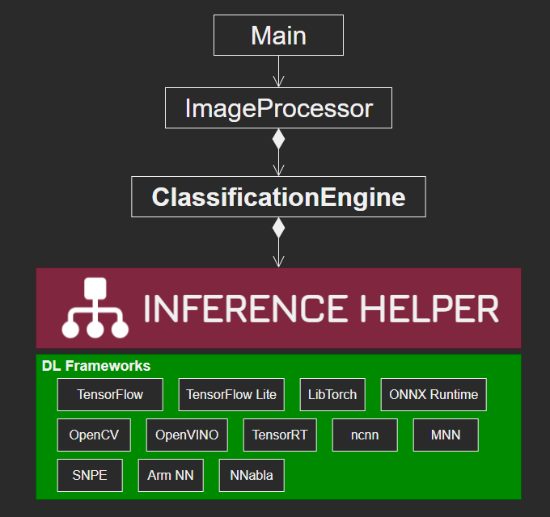

# InferenceHelper_Sample
- Sample project for InferenceHelper (https://github.com/iwatake2222/InferenceHelper )
- Run a simple classification model (MobileNetv2) using several deep leraning frameworks

 

## Usage
```
./main [input]

 - input = blank
    - use the default image file set in source code (main.cpp)
    - e.g. ./main
 - input = *.mp4, *.avi, *.webm
    - use video file
    - e.g. ./main test.mp4
 - input = *.jpg, *.png, *.bmp
    - use image file
    - e.g. ./main test.jpg
 - input = number (e.g. 0, 1, 2, ...)
    - use camera
    - e.g. ./main 0
```

## How to build sample application
### Requirements
- OpenCV 4.x

### Common 
- Get source code
    ```sh
    git clone https://github.com/iwatake2222/InferenceHelper_Sample
    cd InferenceHelper_Sample

    git submodule update --init --recursive
    cd InferenceHelper/third_party/tensorflow
    chmod +x tensorflow/lite/tools/make/download_dependencies.sh
    tensorflow/lite/tools/make/download_dependencies.sh
    ```

- Download prebuilt libraries
    - Download prebuilt libraries (ThirdParty.zip) from https://github.com/iwatake2222/InferenceHelper/releases/ 
    - Extract it to `InferenceHelper/third_party/`
- Download SNPE library
    - https://developer.qualcomm.com/software/qualcomm-neural-processing-sdk/tools
    - Extract `snpe-1.51.0.zip` , then place `lib` and `include` folders to `InferenceHelper/third_party/snpe`
- Download models
    - Download models (resource.zip) from https://github.com/iwatake2222/InferenceHelper_Sample/releases/ 
    - Extract it to `resource/`

### Windows (Visual Studio)
- Configure and Generate a new project using cmake-gui for Visual Studio 2017 64-bit
    - `Where is the source code` : path-to-InferenceHelper_Sample/pj_cls_mobilenet_v2
    - `Where to build the binaries` : path-to-build	(any)
    - Check one of the liseted InferenceHelperFramework (e.g. `INFERENCE_HELPER_ENABLE_MNN` )
- Open `main.sln`
- Set `main` project as a startup project, then build and run!

**Note**
When you use Tensorflow Lite in Visual Studio, use `Release` or `RelWithDebInfo` . If you use `Debug` , you will get exception error while running.

### Linux (PC Ubuntu, Raspberry Pi, Jetson Nano, etc.)
```sh
cd pj_cls_mobilenet_v2
mkdir build && cd build
cmake .. -DINFERENCE_HELPER_ENABLE_MNN=on
make
./main
```

### Linux (Cross compile for armv7 and aarch64)
```
sudo apt install g++-arm-linux-gnueabi g++-arm-linux-gnueabihf g++-aarch64-linux-gnu

export CC=aarch64-linux-gnu-gcc
export CXX=aarch64-linux-gnu-g++
cmake .. -DBUILD_SYSTEM=aarch64 -DINFERENCE_HELPER_ENABLE_MNN=on

export CC=arm-linux-gnueabi-gcc
export CXX=arm-linux-gnueabi-g++
cmake .. -DBUILD_SYSTEM=armv7 -DINFERENCE_HELPER_ENABLE_MNN=on
```

You need to link appropreate OpenCV.

### Android
- Requirements
    - Android Studio
        - Compile Sdk Version
            - 30
        - Build Tools version
            - 30.0.0
        - Target SDK Version
            - 30
        - Min SDK Version
            - 24
            - With 23, I got the following error
                - `bionic/libc/include/bits/fortify/unistd.h:174: undefined reference to `__write_chk'`
                - https://github.com/android/ndk/issues/1179
    - Android NDK
        - 21.3.6528147
    - OpenCV
        - opencv-4.4.0-android-sdk.zip
    - *The version is just the version I used

- Configure NDK
    - File -> Project Structure -> SDK Location -> Android NDK location (before Android Studio 4.0)
        - C:\Users\abc\AppData\Local\Android\Sdk\ndk\21.3.6528147
    - Modify `local.properties` to specify `sdk.dir` and `ndk.dir`  (after Android Studio 4.1)
        ```
        sdk.dir=C\:\\Users\\xxx\\AppData\\Local\\Android\\Sdk
        ndk.dir=C\:\\Users\\xxx\\AppData\\Local\\Android\\sdk\\ndk\\22.0.7026061
        ```

- Import OpenCV
    - Download and extract OpenCV android-sdk (https://github.com/opencv/opencv/releases )
    - File -> New -> Import Module
        - path-to-opencv\opencv-4.3.0-android-sdk\OpenCV-android-sdk\sdk
    - FIle -> Project Structure -> Dependencies -> app -> Declared Dependencies -> + -> Module Dependencies
        - select sdk
    - In case you cannot import OpenCV module, remove sdk module and dependency of app to sdk in Project Structure
- Modify `ViewAndroid\app\src\main\cpp\CMakeLists.txt` to call image processor function you want to use.
    - `set(ImageProcessor_DIR "${CMAKE_CURRENT_LIST_DIR}/../../../../../pj_cls_mobilenet_v2/image_processor")`
- Copy `resource` directory to `/storage/emulated/0/Android/data/com.iwatake.viewandroidinferencehelpersample/files/Documents/resource` (<- e.g.) . The directory will be created after running the app (so the first run should fail because model files cannot be read)

### Options (Select Deep Leraning framework)
- Choose one of the following options.
    - *Note* : InferenceHelper itself supports multiple frameworks (i.e. you can set `on` for several frameworks). However, in this sample project the selected framework is used to `create` InferenceHelper instance for the sake of ease. 

```sh
cmake .. \
-DINFERENCE_HELPER_ENABLE_OPENCV=off \
-DINFERENCE_HELPER_ENABLE_TFLITE=off \
-DINFERENCE_HELPER_ENABLE_TFLITE_DELEGATE_XNNPACK=off \
-DINFERENCE_HELPER_ENABLE_TFLITE_DELEGATE_GPU=off \
-DINFERENCE_HELPER_ENABLE_TFLITE_DELEGATE_EDGETPU=off \
-DINFERENCE_HELPER_ENABLE_TFLITE_DELEGATE_NNAPI=off \
-DINFERENCE_HELPER_ENABLE_TENSORRT=off \
-DINFERENCE_HELPER_ENABLE_NCNN=off \
-DINFERENCE_HELPER_ENABLE_MNN=on \
-DINFERENCE_HELPER_ENABLE_SNPE=off \
-DINFERENCE_HELPER_ENABLE_ARMNN=off
```

### Additional commands for TensorFlow Lite + EdgeTPU
```sh
cp libedgetpu.so.1.0 libedgetpu.so.1
sudo LD_LIBRARY_PATH=./ ./main
```

# License
- InferenceHelper_Sample
- https://github.com/iwatake2222/InferenceHelper_Sample
- Copyright 2020 iwatake2222
- Licensed under the Apache License, Version 2.0

# Acknowledgements
- This project utilizes OSS (Open Source Software)
    - [NOTICE.md](NOTICE.md)
