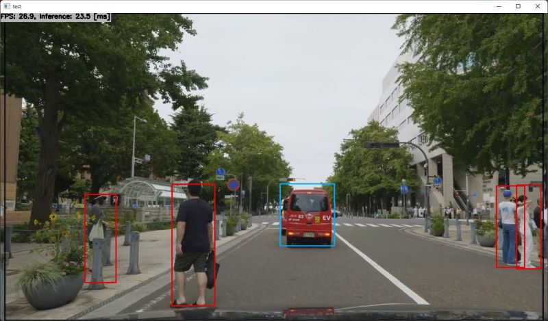

# pedestrian-and-vehicle-detector-adas-0001 with TensorFlowLite/TensorRT/OpenCV/OpenVINO/MNN/ArmNN/NNabla/ONNXRuntime/TensorFlow in C++ on Windows/Linux/Linux(Arm)/Android

]

## Target Environment, How to Build, How to Run
1. Please follow the instruction: https://github.com/iwatake2222/InferenceHelper_Sample
2. Build  `pj_det_pedestrian-and-vehicle-detector-adas-0001` project (this directory)

## Tested Environments
| Framework                 | Windows (x64)   | Linux (x64)     | Linux (aarch64) | Android (aarch64) |
|---------------------------|-----------------|-----------------|-----------------|-------------------|
| TensorFlow Lite           | &check;         | &check;         | &check;         | &check;           |
| TensorFlow Lite + XNNPACK | &check;         | &check;         | &check;         | &check;           |
| TensorFlow Lite + EdgeTPU | Bad result      | Not tested      | Bad result      | Unsupported       |
| TensorFlow Lite + GPU     | No library      | No library      | No library      | &check;           |
| TensorFlow Lite + NNAPI   | No library      | No library      | No library      | &check;           |
| TensorRT                  | &check;         | Not tested      | &check;         | No library        |
| OpenCV(dnn)               | &check;         | &check;         | &check;         | &check;           |
| OpenVINO with OpenCV      | &check;         | &check;         | Unsupported     | Unsupported       |
| ncnn                      | Error           | Error           | No library      | Error             |
| MNN                       | &check;         | &check;         | &check;         | &check;           |
| SNPE                      | Unsupported     | Unsupported     | Not tested      | Not tested        |
| Arm NN                    | Unsupported     | not tested      | &check;         | No library        |
| NNabla                    | &check;         | No library      | No library      | No library        |
| ONNX Runtime              | &check;         | &check;         | &check;         | &check;           |
| LibTorch                  | No model        | No model        | No model        | No model          |
| TensorFlow                | &check;         | Not tested      | No library      | No library        |

## Note
- To run with OpenVINO, enable OpenCV and uncomment the following line
    - `//#define MODEL_NAME  "pedestrian-and-vehicle-detector-adas-0001/model_float32.xml"   /* for OpenVINO */`
- To run on Android, modify `ViewAndroid\app\src\main\cpp\CMakeLists.txt`
    - `set(ImageProcessor_DIR "${CMAKE_CURRENT_LIST_DIR}/../../../../../pj_det_pedestrian-and-vehicle-detector-adas-0001/image_processor")`

## Acknowledgements
- https://docs.openvino.ai/latest/omz_models_model_pedestrian_and_vehicle_detector_adas_0001.html
- https://github.com/PINTO0309/PINTO_model_zoo
- Drive Video by Dashcam Roadshow
    - 4K横浜ドライブ 新横浜→みなとみらい→横浜ベイブリッジ
    - https://www.youtube.com/watch?v=JreKvvItrnM
