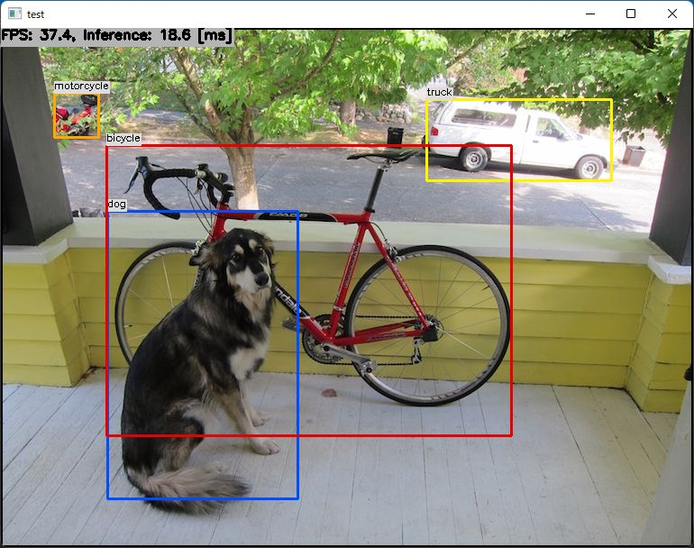

# YOLOX with TensorFlowLite/TensorRT/OpenCV/OpenVINO/ncnn/MNN/ArmNN/ONNXRuntime/TensorFlow in C++ on Windows/Linux/Linux(Arm)/Android

]

## Target Environment, How to Build, How to Run
1. Please follow the instruction: https://github.com/iwatake2222/InferenceHelper_Sample
2. Build `pj_det_yolox` project (this directory)

## Tested Environments
| Framework                 | Windows (x64)   | Linux (x64)     | Linux (aarch64) | Android (aarch64) |
|---------------------------|-----------------|-----------------|-----------------|-------------------|
| TensorFlow Lite           | &check;         | &check;         | &check;         | &check;           |
| TensorFlow Lite + XNNPACK | &check;         | &check;         | &check;         | &check;           |
| TensorFlow Lite + EdgeTPU | Bad result      | Not tested      | Bad result      | Unsupported       |
| TensorFlow Lite + GPU     | No library      | No library      | No library      | &check;           |
| TensorFlow Lite + NNAPI   | No library      | No library      | No library      | &check;           |
| TensorRT                  | &check;         | Not tested      | &check;         | No library        |
| OpenCV(dnn)               | &check;         | &check;         | Not tested      | &check;           |
| OpenVINO with OpenCV      | &check;         | &check;         | Unsupported     | Unsupported       |
| ncnn                      | &check;         | &check;         | No library      | &check;           |
| MNN                       | &check;         | &check;         | &check;         | &check;           |
| SNPE                      | Unsupported     | Unsupported     | Not tested      | Not tested        |
| Arm NN                    | Unsupported     | Not tested      | &check;         | No library        |
| NNabla                    | No model        | No library      | No library      | No library        |
| ONNX Runtime              | &check;         | &check;         | &check;         | Error             |
| LibTorch                  | No model        | No model        | No model        | No model          |
| TensorFlow                | &check;         | Not tested      | No library      | No library        |

## Note
- To run with OpenVINO, enable OpenCV and uncomment the following line
    - `//#define MODEL_NAME  "yolox_nano_480x640/model_float32.xml"   /* for OpenVINO */`
- To run on Android, modify `ViewAndroid\app\src\main\cpp\CMakeLists.txt`
    - `set(ImageProcessor_DIR "${CMAKE_CURRENT_LIST_DIR}/../../../../../pj_det_yolox/image_processor")`

## Acknowledgements
- https://github.com/Megvii-BaseDetection/YOLOX
- https://github.com/PINTO0309/PINTO_model_zoo
- https://github.com/Tencent/ncnn